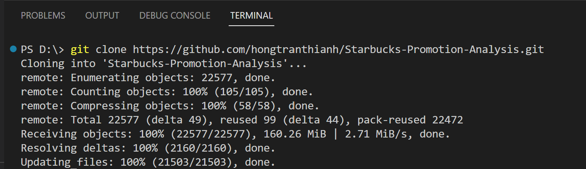
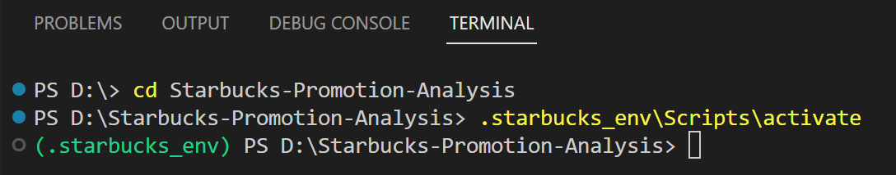

# Starbucks Promotion Analysis

<br>
<div align="center">

</div>
<br>

### Table of Contents

1. [Installation](#installation)
2. [Project Description](#project-description)
    - [Background information](#background-info)
    - [Objectives](#objective)
3. [File Structure](#files)
4. [How to interact](#interact)
5. [Licensing, Authors, and Acknowledgements](#licensing)


## 1. Installation <a name="installation"></a>
* The virtual environment [.starbucks_env](https://github.com/hongtranthianh/Starbucks-Promotion-Analysis/tree/main/.starbucks_env) contains all Python packages to run all notebooks and `.py` file.
* The code should run with no issues using Python versions 3.*. Currently using `Python 3.11.3` on `Windowns 11`.

## 2. Project Description <a name="project-description"></a>

### 2.1. Background information <a name="background-info"></a>
<!---This project is a real experiment from Starbucks and provided as a take-home assignment for their job candidates. For a full description of what Starbucks provides to candidates see the [instructions available here](https://drive.google.com/file/d/18klca9Sef1Rs6q8DW4l7o349r8B70qXM/view).-->

Starbucks had a promotion program and wanted to test if this program would bring more customers to purchase a specific product priced at $10. Since it costs the company 0.15 to send out each promotion, Starbucks needed to limit that promotion to only those that had the likelihood to purchase.

**How did Starbucks facilitate the expriment of the promotion program?**
- Divide the customers into two groups:
    + `Treatment group`: customers were received promotion
    + `Control group`: customers were NOT received promotion
- Observe customer behavior in `Treatment group` against `Control group`, test if there's any positive effect of desirable metrics on `Treatment group` and decide to launch the promotion program.

### 2.2. Objectives <a name="objective"></a>

1. Analyze the effect of the promotion program on two metrics `Incremental Response Rate (IRR)` and `Net Incremental Revenue (NIR)`.
2. Build a classification model to select best customers for the promotion program in a way that maximizes `IRR` and `NIR`.
## 3. File Structure<a name="files"></a>

```
- .starbucks_env #Virtual env to run the project

- data
|- test.csv  #Testing data
|- training.csv  # Training data

- images #Images used in README.md

- 1. data_understanding.ipynb #Get to know the data

- 2. hypothesis_testing.ipynb #For objective 1-analyze the effect of promotion on IRR and NIR

- 3. modeling.ipynb #For objective 2-build a model to select what customers should receive promotion

- test_results.py #Functions to test the promotion strategy with IRR and NIR

- README.md

```

## 4. How to interact<a name="interact"></a>

**Step 1**: Pull this repository to your local machine
```
git clone https://github.com/hongtranthianh/Starbucks-Promotion-Analysis.git
```

<p ></p>

**Step 2** (Optional): Activate the virtual environment used in this project (*you can also use your own environment instead*).

In Windows:

```
cd Starbucks-Promotion-Analysis
```

```
.starbucks_env\Scripts\activate
```

<p ></p>

**Step 3**: Execute [test_results.py](https://github.com/hongtranthianh/Starbucks-Promotion-Analysis/blob/main/test_results.py)

**Step 4**: Find below notebooks for specific purpose

- Get to know the data: [1. data_understanding.ipynb](https://github.com/hongtranthianh/Starbucks-Promotion-Analysis/blob/main/1.%20data_understanding.ipynb)

- Analyze the effect of the promotion program on two metrics `IRR` and `NIR`: [2. hypothesis_testing.ipynb](https://github.com/hongtranthianh/Starbucks-Promotion-Analysis/blob/main/2.%20hypothesis_testing.ipynb)
    
- Build a classifier to select which customer should receive the promotion and test the promotion strategy: [3. modeling.ipynb](https://github.com/hongtranthianh/Starbucks-Promotion-Analysis/blob/main/3.%20modeling.ipynb)

## 5. Licensing, Authors, and Acknowledgements<a name="licensing"></a>

This project is part of the Data Scientist Nanodegree program from Udacity, under module *Experimental Design*.

Thanks Udacity for providing a guideline for this project and thanks Starbucks for providing the datasets.
