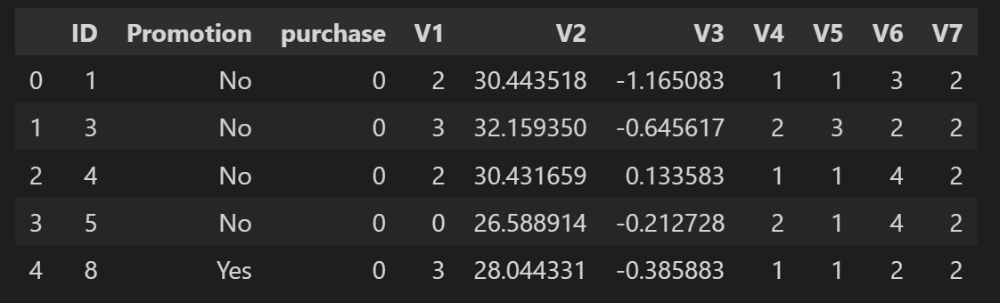

# Experimental Design Starbuck

 

 

### Table of Contents

1. [Installation](#installation)
2. [Project Description](#description)
3. [File Description](#files)
4. [Results](#results)
5. [Licensing, Authors, and Acknowledgements](#licensing)

## Installation 

## Project Description
### Data

The datasets that were used in this project was originally provided by Starbucks as a take-home assignment for their job candidates. So it's a real Starbucks experiment.

There are about 120,000 data points split in a 2:1 ratio among training and testing set. 

In the experiment simulated by the data, an advertising promotion was tested to see if it would bring more customers to purchase a specific product priced at $10. Since it costs the company 0.15 to send out each promotion, it would be best to limit that promotion only to those that are most receptive to the promotion.

Each data point includes one column indicating whether or not an individual was sent a promotion for the product, and one column indicating whether or not that individual eventually purchased that product. Each individual also has seven additional features associated with them, which are provided abstractly as V1-V7.

### Objective of the project

1. Analyze the results of the experiment and identify the effect of the Treatment on
product purchase and Net Incremental Revenue
2. Build a model to select the best customers to target that maximizes the Incremental
Response Rate and Net Incremental Revenue.

**Note**:
- Incremental Response Rate (IRR)
IRR depicts how many more customers purchased the product with the promotion, as compared to if they didn't receive the promotion.

    $$ IRR = \frac{Number_of_Purchasers_{Treatement}}{Total_Customers_{Treatement}} - \frac{Number_of_Purchasers_{Control}}{Total_Customers_{Control}} $$

- Net Incremental Revenue (NIR)
NIR depicts how much is made (or lost) by sending out the promotion

    $$ NIR = (10\cdot purch_{treat} - 0.15 \cdot cust_{treat}) - 10 \cdot purch_{ctrl}$$

### Deliverables

1. Score the ‘Test.csv’ using the model and select the best customers and share the
customer ID’s as csv file
2. Explain briefly the approach used in a separate document and also share the code that
can be executed to reproduce results.

## File Description

## Results

The main findings of the code can be found at the post available [here]()

## Licensing, Authors, and Acknowledgements

Feel free to use the code here as you would like.